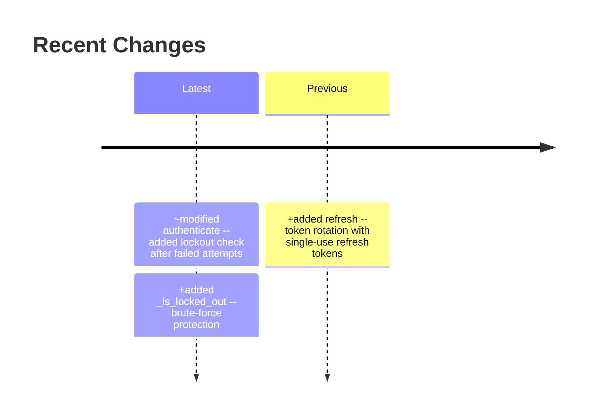
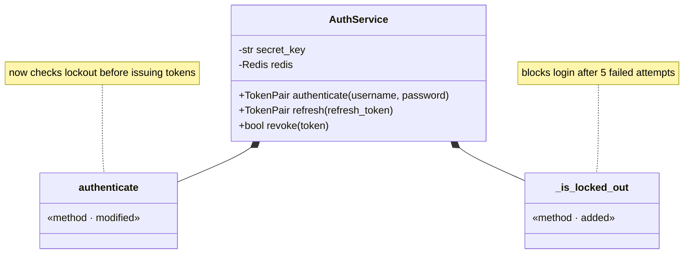
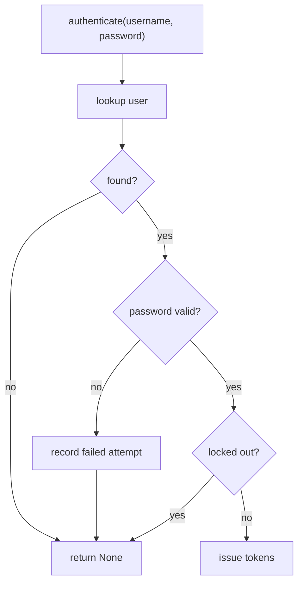
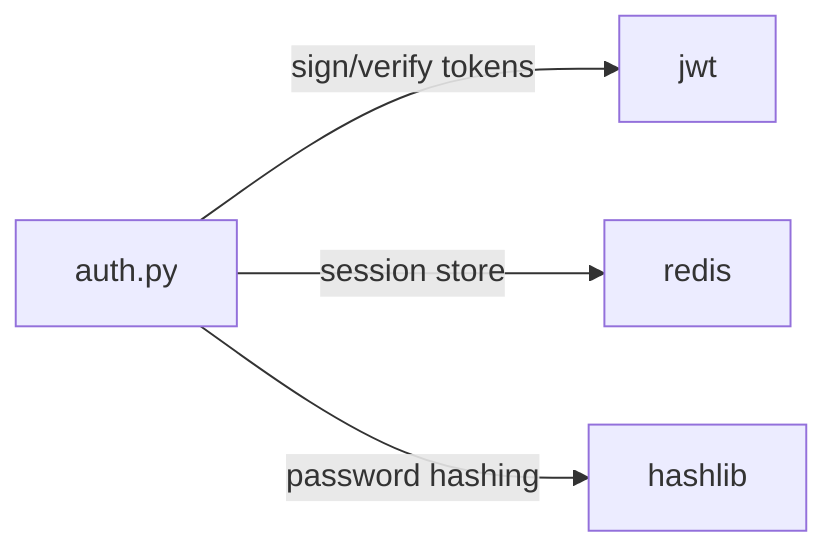

# Glassbox

**See inside your AI-written code without reading it.**

> *"The hottest new programming language is English."*
> — Andrej Karpathy, January 2023

He was right. Two years later, he gave it a name: **vibe coding**. And now, in 2026, it's just... coding. AI agents write the code. You describe what you want in plain language, the agent makes it happen, and you approve the changes. That's the workflow.

But here's the uncomfortable part: **you're approving code you haven't read.**

And honestly? You probably shouldn't read it. Not line by line. The same way you don't read assembly output when you write Python — you've moved up a level of abstraction, and your cognitive load is better spent elsewhere. Code is becoming a **compilation target**, not a human-authored artifact. The shift from Software 1.0 (hand-written logic) to Software 3.0 (natural language to code) means the layer humans operate at is no longer syntax — it's intent, architecture, and behavior.

The endgame is fully agentic, zero-shot software engineering — you describe what you want, the agent builds, tests, and ships it, and you never look at a line of code. We'll get there. But we're not there yet (or maybe I am not ready for that yet). We're in the messy middle, where agents are good enough to write your code but not yet trustworthy enough to ship it unsupervised. You still need to understand what's happening, or atleast you should still understand what's happening. You just shouldn't have to read source code to do it.

**Glassbox is the middle layer for the transition.**

It automatically generates visual companion files (`.vis.md`) for every code file your AI agent touches. Instead of reviewing raw code, you get mermaid diagrams showing structure, control flow, dependencies, and what just changed — all rendered natively in your editor's markdown preview. Your codebase becomes a **glass box** instead of a black box.

Built for [Cursor](https://cursor.com). The same idea can be adapted for [Claude Code](https://docs.anthropic.com/en/docs/claude-code) or any agent that supports custom instructions — the core is just a rule file and a hook script. Works with any project, any language.

## What you get

Every `.vis.md` is a set of mermaid diagrams — no prose walls, just visuals:

- **Change timeline** — what was added, modified, or removed, rendered as a timeline
- **Structure diagram** — classes, functions, and relationships, with the latest changes annotated directly on the components
- **Flow diagram** — control flow with decisions and branches, not line-by-line code
- **Dependency graph** — what this file imports and why

Spend 30 seconds scanning diagrams instead of 10 minutes reading code. Use your cognitive load where it actually matters: deciding *what* to build, not verifying *how* it was built.

## What it looks like

For a file like `src/auth.py`, Glassbox creates `.vis/src/auth.py.vis.md`:

### Change timeline



### Structure with change annotations



### Control flow



### Dependencies



> See the full example: [examples/auth.py.vis.md](examples/auth.py.vis.md) for [examples/auth.py](examples/auth.py)

## How it works

Glassbox has two layers:

| Layer | What it does | How |
|-------|-------------|-----|
| **Cursor Rule** | Tells the AI agent to create/update `.vis.md` files alongside every code edit | `glassbox.mdc` — always-apply rule with the template and guidelines |
| **Stop Hook** | Safety net that catches missed files after the agent finishes | `check-vis-md.sh` — compares MD5 hashes to detect missing, stale, or orphaned `.vis.md` files and sends the agent back to fix them |

The `.vis.md` files live in a `.vis/` directory that mirrors your source tree, plus a project-level index:

```
project/
  src/
    auth.py
    utils.py
  .vis/
    _index.vis.md        <-- project-level architecture view
    src/
      auth.py.vis.md
      utils.py.vis.md
```

### Project index

`.vis/_index.vis.md` is an auto-maintained project-level architecture view. It contains:

- **Module Map** — a `graph LR` mermaid diagram showing cross-file dependencies grouped by directory
- **File Inventory** — a table of every visualized file, its purpose, and most recent change

The agent creates and updates the index whenever a `.vis.md` is created or changed. The hook detects when the index is missing or stale.

## Install

### Quick install (recommended)

```bash
curl -fsSL https://raw.githubusercontent.com/user/glassbox/main/install.sh | bash
```

### Manual install

1. **Copy the rule** to your Cursor rules directory:

```bash
mkdir -p ~/.cursor/rules
cp glassbox.mdc ~/.cursor/rules/glassbox.mdc
```

2. **Copy the hook script:**

```bash
mkdir -p ~/.cursor/hooks
cp check-vis-md.sh ~/.cursor/hooks/check-vis-md.sh
chmod +x ~/.cursor/hooks/check-vis-md.sh
```

3. **Add the hook config.** If you don't have `~/.cursor/hooks.json` yet:

```bash
cp hooks.json ~/.cursor/hooks.json
```

If you already have one, merge the `stop` hook entry into your existing file:

```json
{
  "version": 1,
  "hooks": {
    "stop": [
      {
        "command": "bash ./hooks/check-vis-md.sh",
        "loop_limit": 2,
        "timeout": 30
      }
    ]
  }
}
```

4. **Restart Cursor** (or open a new window) to pick up the changes.

### Project-level install (single repo)

If you prefer per-project instead of global:

```bash
# From your project root
mkdir -p .cursor/rules .cursor/hooks
cp /path/to/glassbox/glassbox.mdc .cursor/rules/glassbox.mdc
cp /path/to/glassbox/check-vis-md.sh .cursor/hooks/check-vis-md.sh
cp /path/to/glassbox/hooks.json .cursor/hooks.json
chmod +x .cursor/hooks/check-vis-md.sh
```

## Usage

Once installed, just use Cursor normally. When the agent edits code files, it will automatically:

1. Create `.vis/` directory structure matching your source tree
2. Generate a `.vis.md` for each code file with mermaid diagrams
3. Update the diagrams and change timeline on subsequent edits
4. Mark modified components with `· modified` / `· added` annotations

To view the diagrams, open any `.vis.md` file and use **Markdown Preview** (`Cmd+Shift+V` on Mac, `Ctrl+Shift+V` on Windows/Linux).

### What gets skipped

Glassbox ignores non-code files: lock files, config files (`.eslintrc`, `tsconfig.json`), dotfiles (`.env`, `.gitignore`), images, and dependency directories (`node_modules/`, `venv/`).

### Orphan cleanup

When you delete a source file, the hook detects that its `.vis.md` companion is orphaned (source no longer exists) and sends the agent back to remove it. This keeps `.vis/` clean over time.

### Committing .vis files

The `.vis/` directory is designed to be committed to git. This way your team and your future self can always see the visual documentation alongside the code.

## CI mode

The hook script supports a `--ci` flag for use in CI pipelines (GitHub Actions, pre-commit hooks, etc.). In CI mode it prints a human-readable report and exits with code 1 if any violations are found.

```bash
bash check-vis-md.sh --ci
```

### GitHub Actions example

```yaml
name: Glassbox Check
on: [pull_request]
jobs:
  check-vis:
    runs-on: ubuntu-latest
    steps:
      - uses: actions/checkout@v4
      - run: bash check-vis-md.sh --ci
```

### pre-commit hook

```yaml
# .pre-commit-config.yaml
repos:
  - repo: local
    hooks:
      - id: glassbox
        name: Glassbox vis.md check
        entry: bash check-vis-md.sh --ci
        language: system
        pass_filenames: false
```

### What CI mode detects

| Violation | Description |
|-----------|-------------|
| **Missing** | Code file changed but no `.vis.md` companion exists |
| **Stale** | Source hash in `.vis.md` doesn't match the current source file |
| **Orphaned** | `.vis.md` exists but its source file has been deleted |
| **Index stale** | `.vis/_index.vis.md` is missing or needs updating |

## Requirements

- [Cursor](https://cursor.com) with hooks support
- `python3` (used by the hook script for JSON escaping)
- `md5` (macOS) or `md5sum` (Linux) — for content hash verification
- `git` — the hook uses git to detect changed files

## License

MIT
