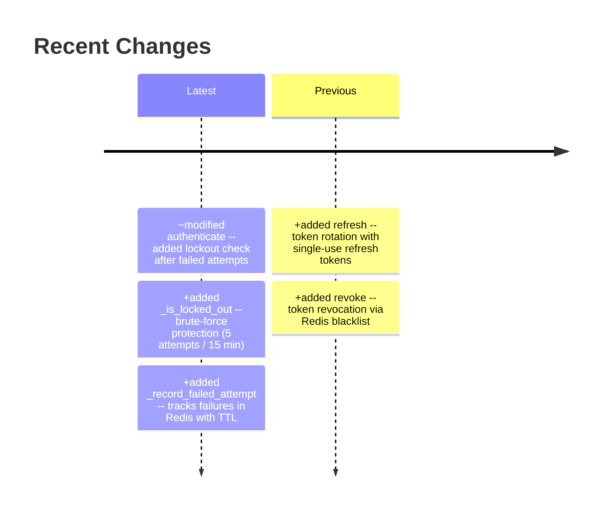
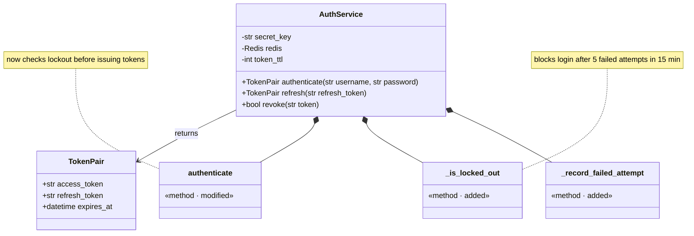
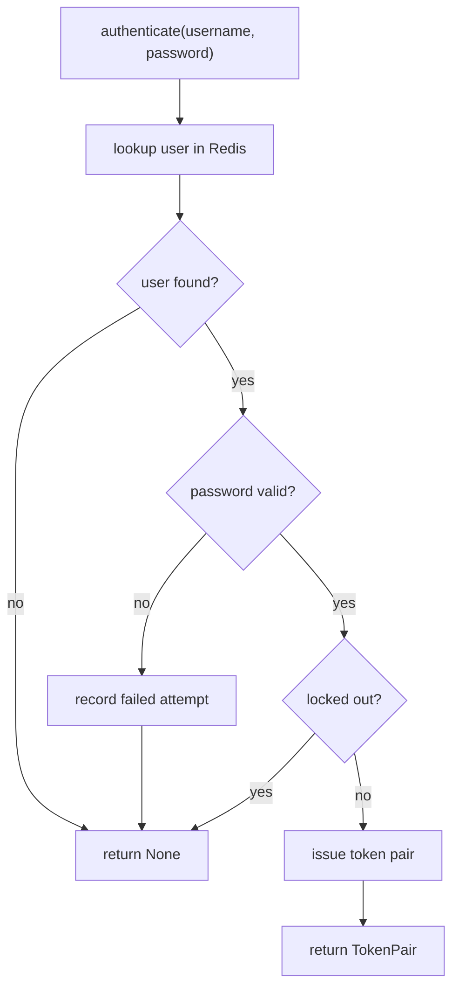
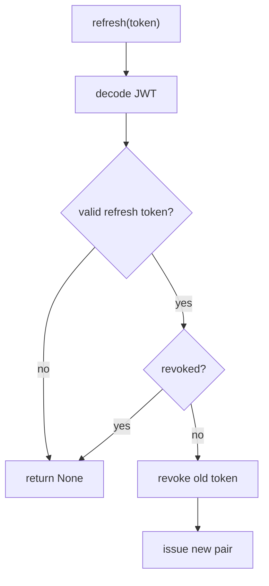
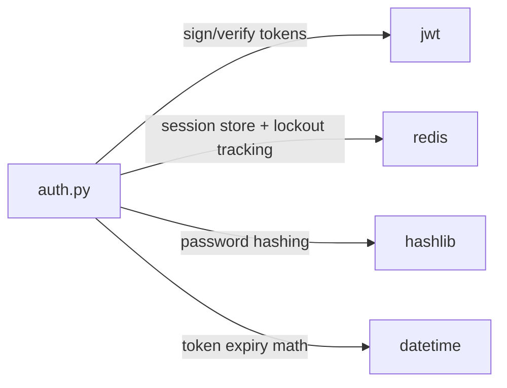

<!-- source-hash: a1b2c3d4e5f6a7b8c9d0e1f2a3b4c5d6 -->
# src/auth.py

> JWT-based authentication service with Redis-backed sessions and brute-force protection

## Recent Changes

## Structure

## Flow

## Dependencies

